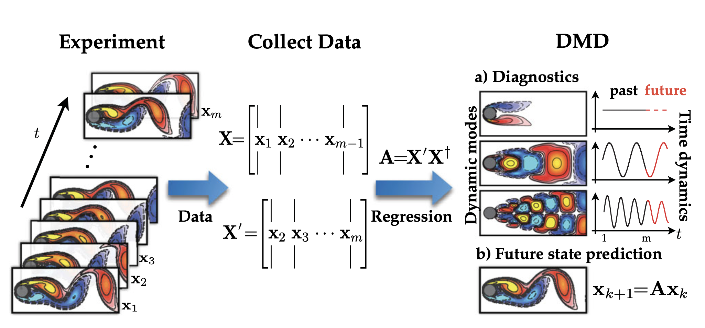

# Dynamic Mode Decomposition for Koopman Operator Learning

This directory contains implementations of various Dynamic Mode Decomposition (DMD) methods for learning the Koopman operator for [CTF-for-Science](https://github.com/CTF-for-Science).

Dynamic Mode Decomposition is a data-driven technique used to extract dynamic information from time-series data. This algorithm was developed by [Schmid 2010](https://www.cambridge.org/core/journals/journal-of-fluid-mechanics/article/dynamic-mode-decomposition-of-numerical-and-experimental-data/AA4C763B525515AD4521A6CC5E10DBD4) [1] to identify spatial and temporal coherent structures from high-dimensional data for fluid-dynamics applications. This algorithm provides a modal decomposition where each mode consists of spatially correlated structures with the same linear behavior in time (e.g., oscillations at a given frequency with growth or decay); thus, DMD finds the linear coordinate system that best fits the starting dataset. By ranking the importance of the modes through the singular values of the data matrix, which offer a measure of the 'information content' of the associated modes, DMD can build a low-dimensional surrogate linear model that can simulate the temporal evolution of these spatial modes [2].

More in detail, let $\mathbf{x}(t)\in\mathbb{R}^{\mathcal{N}_h}$ being some high-dimensional measurements of the state of the system over time $t$, collected at different time instants $\{t_k\}_{k=1}^{N_t}$ and arranged in a snapshot matrix of size $\mathcal{N}_h \times \mathcal{N}_t$ in the following way:
```math
    \mathbb{X} = [\mathbf{x}(t_1) \mid \mathbf{x}(t_2) \mid \dots \mid \mathbf{x}(t_{N_t})] =  [\mathbf{x}_1 \mid \mathbf{x}_2 \mid \dots \mid \mathbf{x}_{N_t}] \in \mathbb{R}^{\mathcal{N}_h \times N_t}
```
where $\mathcal{N}_h$ is the number of spatial degrees of freedom of the FOM and $\mathcal{N}_t$ is the number of saved time instants. The DMD seeks the best-fit linear operator $\mathbb{A}$ that best represents the dataset $\mathbb{X}$ and that allows the underlying system to advance in time, such that
```math
    \mathbf{x}_{k+1} \approx \mathbb{A}\mathbf{x}_k
```

<br />
<p align="center" width="75%">
  
  <br />
</p>
<br />

Different variants of DMD have been proposed to improve the performance of the original algorithm, such as:
- **Classic DMD**: The original DMD algorithm, which uses the snapshot matrix to compute the DMD modes and eigenvalues.
- **Hankel Preprocessing**: A preprocessing step that uses Hankel matrices to improve the DMD results by capturing the temporal correlations in the data.
- **Bagging Optimised DMD**: A variant of DMD that uses bagging techniques to improve the robustness and accuracy of the DMD results by combining multiple DMD models trained on different subsets of the data.

## Files

- `dmd.py`: Contains the implementation of the DMD classes designed to work within [CTF-for-Science](https://github.com/CTF-for-Science), based on the model logic of [pyDMD](https://github.com/PyDMD/PyDMD/tree/master) [3].
- `run.py`: Batch runner script to create the DMD model across multiple sub-dataset within the [CTF-for-Science](https://github.com/CTF-for-Science) framework.
- `config/`: Directory containing configuration files for different datasets and DMD variants.

The configuration files specify the hyperparameters for the DMD methods, including the dataset to be used, the pair ID, and the specific DMD variant to be applied. The configuration files are in YAML format and can be easily modified to suit different datasets or DMD variants:

```yaml
dataset:
  name: <dataset_name>            # name of the dataset (either 'ODE_Lorenz' or 'PDE_KS')
  pair_id: 'all'                  # or a specific pair ID as [1,2,3,4]
model:
  name: DMD
  method: <dmd_method>            # classic, hankel, highorder, bagging
  rank: <rank>                    # number of modes to keep
  parametric: <parametric_mode>   # Mode to use to extend DMD to parametric systems (either `monolithic` or `partitioned`)
```

## Usage

In the `CTF-for-Science` root directory, run the following command to install the package:

```bash
python models/DMDvariants/run.py models/DMDvariants/config/config_<dataset_name>_<method>.yaml
```

## Dependencies

This repository rely on packages in the main `requirements.txt`:
- pyyaml
- numpy
- pydmd
- ezyrb

The packages can be installed using pip:

```bash
pip install -r requirements.txt
```

## References

1. P. J. Schmid, “Dynamic Mode Decomposition of numerical and experimental data,” Journal of Fluid Mechanics,
656, 5 (2010); [10.1017/S0022112010001217](doi.org/10.1017/S0022112010001217), URL [https://doi.org/10.1017/S0022112010001217](https://doi.org/10.1017/S0022112010001217), publisher: Cambridge University Press.
2. J. Nathan Kutz, Steven L. Brunton, Bingni W. Brunton, and Joshua L. Proctor, “Dynamic Mode Decomposition: Data-Driven Modeling of Complex Systems” SIAM-Society for Industrial and Applied Mathematics; [10.1137/1.9781611974508](doi.org/10.1137/1.9781611974508), URL [https://epubs.siam.org/doi/abs/10.1137/1.
9781611974508](https://epubs.siam.org/doi/book/10.1137/1.9781611974508).
3. S. M. Ichinaga, F. Andreuzzi, N. Demo, M. Tezzele, K. Lapo, G. Rozza, S. L. Brunton, and J. N. Kutz,
“PyDMD: A Python package for robust dynamic mode decomposition,” (2024) URL [https://arxiv.org/abs/
2402.07463](https://arxiv.org/abs/2402.07463).
